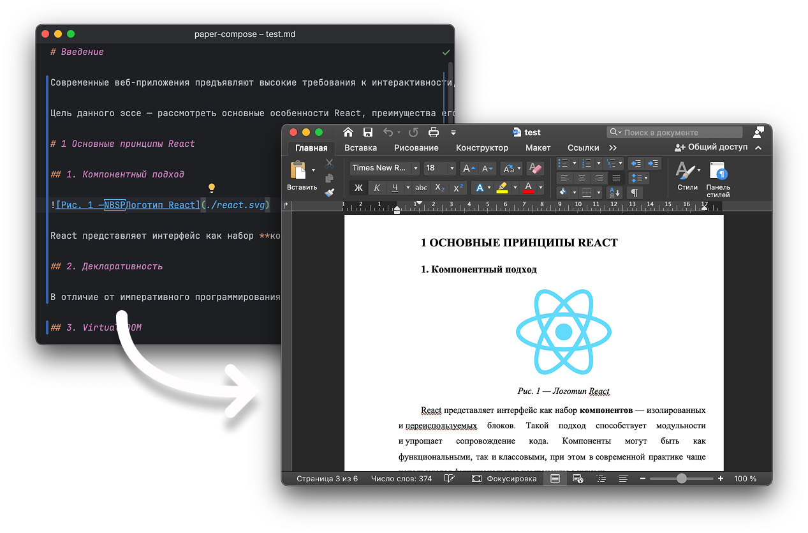

# paper-compose



Утилита для конвертации **Markdown** в **DOCX** с автоматическим форматированием по ГОСТу.
Подходит для студентов: пишите практическую или курсовую работу в Markdown и конвертируйте в готовый Word-файл одной 
командой.

---

## Установка

Требуется **Node.js ≥ 18**.

```bash
npm i -g paper-compose
```

---

## Использование

1. Подготовьте текст работы в формате Markdown.
2. Выполните команду на md-файле:

```bash
paper-compose <your-file>.md
```

---

## Возможности

Утилита активно дорабатывается, но уже содержит минимальный набор функций:

* Поддержка заголовков **трёх уровней**.
* Списки (нумерованные и маркированные).
* Вставка картинок. Альт-текст станет подписью к картинке.
* Автоматическое **типографирование** (кавычки, тире и т. д.).
* Автосборка **оглавления**.
* Форматирование по ГОСТу (шрифты, отступы, стиль заголовков).
